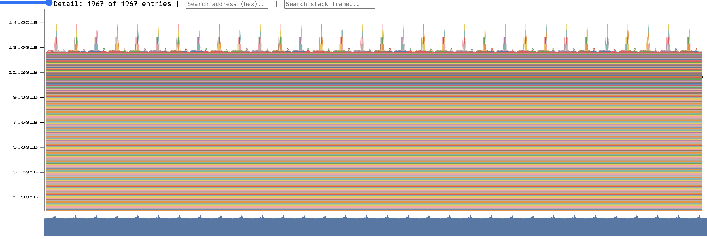
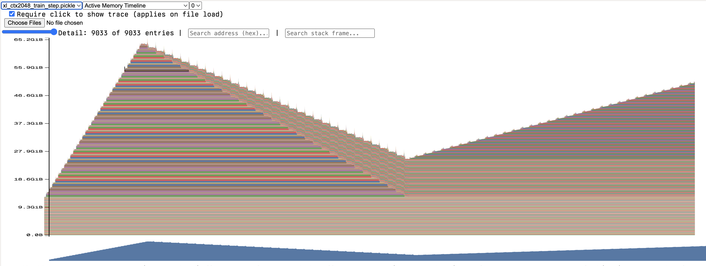

# Assignment 2 Experiments

## 2.1.3 End-to-End Benchmarking

Setup:
- GPU: Modal B200
- Batch size: 4
- Context length: 512
- Vocab size: 10,000
- Measurement steps: 10
- Baseline warmup steps: 5
- Model: `cs336_basics.model.BasicsTransformerLM` from the provided `cs336-basics` package

Scripts/files:
- Benchmark script: `scripts/benchmark.py`
- Modal runner: `scripts/modal_benchmark.py`
- Raw outputs: `benchmark_small_to_xl.txt`, `benchmark_10b.txt`, `benchmark_no_warmup.txt`, `benchmark_1_warmup.txt`, `benchmark_2_warmup.txt`
- CSV summary: `benchmark_results.csv`

### Part (b): 5 warmup steps

Forward and backward timings with 5 warmup steps and 10 measured steps:

| size | forward mean (s) | forward std (s) | forward+backward mean (s) | backward estimate (s) | train step mean (s) | optimizer estimate (s) |
|---|---:|---:|---:|---:|---:|---:|
| small | 0.016467 | 0.000023 | 0.049401 | 0.032935 | 0.056596 | 0.007195 |
| medium | 0.047008 | 0.000033 | 0.140251 | 0.093243 | 0.160285 | 0.020034 |
| large | 0.106030 | 0.000031 | 0.314072 | 0.208042 | 0.351535 | 0.037463 |
| xl | 0.295591 | 0.000186 | 0.865023 | 0.569432 | 0.944706 | 0.079683 |
| 10B | 0.944138 | 0.000524 | 2.809717 | 1.865579 | OOM | OOM |

Writeup draft:

> On a B200 GPU with batch size 4 and context length 512, forward pass times for small/medium/large/xl/10B were 0.0165s, 0.0470s, 0.1060s, 0.2956s, and 0.9441s; estimated backward times were 0.0329s, 0.0932s, 0.2080s, 0.5694s, and 1.8656s. Standard deviations were small relative to the means, indicating low variability; the 10B full training step ran out of memory during the AdamW optimizer step.

Notes:
- Backward estimate is `forward_backward_mean - forward_mean`.
- Optimizer estimate is `train_step_mean - forward_backward_mean`.
- 10B `train_step` OOMed during AdamW optimizer state allocation/update in `cs336_basics/optimizer.py`.

### Part (c): warmup effect

No-warmup summary:

| size | forward mean (s) | forward std (s) | backward estimate (s) | train step mean (s) |
|---|---:|---:|---:|---:|
| small | 0.059935 | 0.137349 | 0.086425 | 0.152889 |
| medium | 0.087619 | 0.128535 | 0.141663 | 0.254866 |
| large | 0.149083 | 0.135891 | 0.250219 | 0.438702 |
| xl | 0.336971 | 0.124035 | 0.613277 | 1.032298 |

1-warmup summary:

| size | forward mean (s) | forward std (s) | backward estimate (s) | train step mean (s) |
|---|---:|---:|---:|---:|
| small | 0.016329 | 0.000064 | 0.032514 | 0.057444 |
| medium | 0.046895 | 0.000135 | 0.093323 | 0.157518 |
| large | 0.106062 | 0.000024 | 0.208141 | 0.344278 |
| xl | 0.293102 | 0.000643 | 0.569525 | 0.942397 |

2-warmup summary:

| size | forward mean (s) | forward std (s) | backward estimate (s) | train step mean (s) |
|---|---:|---:|---:|---:|
| small | 0.016327 | 0.000014 | 0.032492 | 0.056427 |
| medium | 0.046947 | 0.000064 | 0.093294 | 0.157019 |
| large | 0.106490 | 0.000045 | 0.208919 | 0.345619 |
| xl | 0.295964 | 0.000816 | 0.571503 | 0.946053 |

Writeup draft:

> Without warmup, the first measured iteration includes CUDA/PyTorch initialization, allocator setup, and optimizer-state allocation effects, so the mean timings become inflated and the standard deviations become much larger. With 1–2 warmup steps, the results become close to the 5-warmup steady-state numbers, but they can still differ slightly because not all kernels, memory allocator state, and optimizer/cache behavior are fully stabilized after only a small number of warmup iterations.

## 2.1.4 Nsight Systems Profiling

Setup:
- GPU: RunPod A100 SXM
- Batch size: 4
- Vocab size: 10,000
- Model sizes: `small`, `medium`
- Context lengths profiled: 256, 512, 1024; additionally 2048 for `small` forward/train-step and `medium` forward
- Nsight Systems: `nsys profile --sample=none --cpuctxsw=none --trace=cuda,cudnn,cublas,osrt,nvtx`
- Notes: `--gpu-metrics-devices=0` was unavailable due `ERR_NVGPUCTRPERM`; `--pytorch=...` was unavailable in Nsight Systems 2024.6.2. Manual NVTX ranges were used for `warmup`, `measurement`, `forward`, `backward`, `optimizer_step`, and attention sub-operations.

Scripts/files:
- Benchmark script: `scripts/benchmark.py`
- Profiles: `runpod_outputs/profiles/*.nsys-rep`
- Stats summaries: `runpod_outputs/profile_stats/*.txt`

Forward pass measured NVTX range times:

| size | ctx | forward time from nsys `measurement` range (ms) |
|---|---:|---:|
| small | 256 | 25.874 |
| small | 512 | 43.709 |
| small | 1024 | 98.361 |
| small | 2048 | 256.877 |
| medium | 256 | 64.073 |
| medium | 512 | 132.155 |
| medium | 1024 | 293.860 |
| medium | 2048 | 753.133 |

Top cumulative CUDA kernels in forward profiles. Instance counts below divide total profile counts by 6 because the profile includes 5 warmup forwards plus 1 measured forward.

| size | ctx | top forward CUDA kernel | invocations / forward |
|---|---:|---|---:|
| small | 256 | `ampere_sgemm_32x128_tn` | 60 |
| small | 512 | `ampere_sgemm_128x32_tn` | 24 |
| small | 1024 | `ampere_sgemm_128x64_tn` | 25 |
| small | 2048 | `ampere_sgemm_128x64_tn` | 25 |
| medium | 256 | `ampere_sgemm_128x64_tn` | 169 |
| medium | 512 | `ampere_sgemm_128x128_tn` | 144 |
| medium | 1024 | `ampere_sgemm_128x64_tn` | 145 |
| medium | 2048 | `ampere_sgemm_128x32_tn` | 120 |

Representative attention NVTX timings from forward profiles:

| size | ctx | attention-score matmul total (ms) | softmax total (ms) | final attention matmul total (ms) |
|---|---:|---:|---:|---:|
| small | 512 | 47.970 | 38.778 | 17.610 |
| medium | 512 | 56.041 | 44.001 | 24.646 |
| small | 2048 | 46.213 | 38.727 | 18.691 |
| medium | 2048 | 120.933 | 218.509 | 26.054 |

Train-step profiles:

| size | ctx | train-step `measurement` range (ms) | top cumulative CUDA kernel |
|---|---:|---:|---|
| small | 256 | 113.793 | `ampere_sgemm_64x32_sliced1x4_nt` |
| small | 512 | 149.625 | `ampere_sgemm_64x32_sliced1x4_nt` |
| small | 1024 | 326.685 | `ampere_sgemm_64x32_sliced1x4_nt` |
| small | 2048 | 833.748 | `ampere_sgemm_128x128_nt` |
| medium | 256 | 248.012 | `ampere_sgemm_128x64_tn` |
| medium | 512 | 455.607 | `ampere_sgemm_128x64_nn` |
| medium | 1024 | 965.841 | `ampere_sgemm_128x64_tn` |

Notes for writeup draft:
- For part (a), the nsys `measurement` range times match the benchmark script timings closely (e.g. small/ctx512 was about 43.7 ms in nsys vs. 43.2 ms from the script output; medium/ctx512 was about 132.2 ms vs. 130.9 ms).
- For part (b), the top forward kernels are SGEMM matrix-multiplication kernels; in full train-step profiles the top cumulative kernels often change to backward/gradient GEMM variants, so the top kernel is not always the same as forward-only.
- For part (c), non-matmul kernels with non-trivial runtime include PyTorch elementwise kernels, vectorized elementwise kernels, reductions for RMSNorm/softmax, `exp`, `sigmoid`, `rsqrt`, `pow`, cat/copy, gather/scatter, and arange/indexing kernels.
- For part (d), full train-step profiles contain many more non-matmul elementwise/reduction kernels from backward and AdamW, so the runtime is less purely dominated by forward GEMMs than inference-only.
- For part (e), softmax is far fewer FLOPs than the attention matrix multiplications but can take a comparable or even larger amount of wall-clock time at long contexts because it is memory/reduction heavy rather than dense-matmul compute heavy.

## 2.1.5 Mixed Precision

### Problem (mixed_precision_accumulation)

Script:
- `scripts/mixed_precision_accumulation.py`

Output:

```text
float32 += float32: tensor(10.0001) torch.float32
float16 += float16: tensor(9.9531, dtype=torch.float16) torch.float16
float32 += float16: tensor(10.0021) torch.float32
float32 += float16 cast to float32: tensor(10.0021) torch.float32
```

Writeup draft:

> The exact result should be 10.0. Accumulating entirely in FP32 gives 10.0001, while accumulating in FP16 gives 9.9531 because FP16 has much lower precision and repeatedly rounds the partial sum. Keeping the accumulator in FP32 improves stability, but when each added value is first represented as FP16 the quantization error of 0.01 remains, giving about 10.0021.

### Problem (benchmarking_mixed_precision) part (a)

Script:
- `scripts/mixed_precision_toy_dtypes.py`

Output on CUDA with `torch.autocast(device_type="cuda", dtype=torch.float16)`:

```text
parameters: torch.float32
fc1 output: torch.float16
layer norm output: torch.float32
logits: torch.float16
loss: torch.float16
gradients: torch.float32
```

Writeup draft:

| component | dtype |
|---|---|
| model parameters within autocast | `torch.float32` |
| `ToyModel.fc1` output | `torch.float16` |
| `ToyModel.ln` output | `torch.float32` |
| logits | `torch.float16` |
| loss | `torch.float16` |
| gradients | `torch.float32` |

Autocast does not change the model parameter dtype, so parameters remain FP32. Linear layers are autocast to FP16, while LayerNorm remains FP32 because normalization/reduction operations are numerically sensitive; gradients are FP32 because the original parameters are FP32.

### Problem (benchmarking_mixed_precision) part (b)

Writeup draft:

> The sensitive parts of LayerNorm are the reductions used to compute the mean and variance, and the normalization division by `sqrt(var + eps)`. These operations accumulate many values and can involve small denominators, so FP16 rounding error or underflow/overflow can noticeably affect the result. BF16 has the same exponent range as FP32, so it is much less prone to FP16-style overflow/underflow, but its shorter mantissa means reductions can still lose precision; therefore keeping LayerNorm reductions in FP32 is still a safe default, though BF16 makes special handling less critical than FP16.

### Problem (benchmarking_mixed_precision) part (c)

Benchmarked on an NVIDIA A100 80GB PCIe with batch size 1 and context length 512.

| model | forward FP32 (s) | forward BF16 (s) | forward+backward FP32 (s) | forward+backward BF16 (s) |
|---|---:|---:|---:|---:|
| small | 0.0136 | 0.0095 | 0.0445 | 0.0345 |
| medium | 0.0395 | 0.0193 | 0.1268 | 0.0640 |
| large | 0.0785 | 0.0305 | 0.2531 | 0.1023 |
| xl | 0.2423 | 0.0610 | 0.7425 | 0.2052 |
| 10B | 0.8753 | 0.1753 | OOM | OOM |

Deliverable:

> With BF16 mixed precision, forward time improved from 0.0136s to 0.0095s for small, 0.0395s to 0.0193s for medium, 0.0785s to 0.0305s for large, 0.2423s to 0.0610s for xl, and 0.8753s to 0.1753s for 10B. Forward+backward time improved from 0.0445s to 0.0345s for small, 0.1268s to 0.0640s for medium, 0.2531s to 0.1023s for large, and 0.7425s to 0.2052s for xl; the 10B forward+backward run OOMed in both FP32 and BF16 on this GPU. The speedup grows with model size because larger models spend more time in GEMM-heavy Transformer layers, where BF16 tensor-core kernels provide a larger benefit.

## 2.1.6 Profiling Memory

### Problem (memory_profiling) part (a)

Added `--profile-memory`, `--memory-snapshot-path`, and `--memory-profile-max-entries` to `scripts/benchmark.py`. The profiler runs the normal benchmark setup, records CUDA memory history for one measured step, dumps a pickle snapshot, and stops memory-history recording.

Forward pass, xl model, context length 2048:



In the forward-only memory timeline, memory stays near the model-parameter baseline of about 13 GiB. The small repeated spikes come from temporary attention and feed-forward activations inside each Transformer block, and they are freed after each layer because this run does not save activations for backward.

Full training step, xl model, context length 2048:



In the full training-step timeline, memory rises steadily during the forward pass as activations are saved for backward, peaks around 65 GiB, and then decreases during backward as those saved tensors are freed. The final increase corresponds to gradients and AdamW optimizer state being materialized.

Deliverable:

> In the forward-only memory timeline, memory stays near the model-parameter baseline with small repeated spikes from temporary per-layer activations. In the full training-step timeline, memory rises during forward as activations are saved for backward, falls during backward as those tensors are freed, and rises again when gradients and AdamW optimizer state are materialized. Therefore the forward, backward, and optimizer stages are distinguishable from the shape of the memory timeline.

### Problem (memory_profiling) part (b)

Peak active CUDA memory for the xl model, batch size 1, FP32:

| context length | forward peak memory | full train-step peak memory |
|---:|---:|---:|
| 128 | 12.8 GiB | 51.4 GiB |
| 2048 | 14.9 GiB | 65.6 GiB |

### Problem (memory_profiling) part (c)

Peak active CUDA memory for the xl model with BF16 autocast, batch size 1:

| context length | BF16 forward peak memory | BF16 full train-step peak memory |
|---:|---:|---:|
| 128 | 19.1 GiB | 51.4 GiB |
| 2048 | 20.5 GiB | 57.1 GiB |

Deliverable:

> With BF16 autocast, the forward-only peak was 19.1 GiB at context length 128 and 20.5 GiB at context length 2048, which is higher than the FP32 forward-only peaks because autocast keeps FP32 parameters and may also cache lower-precision copies/workspaces. For the full training step, BF16 was essentially unchanged at context length 128 (51.4 GiB vs. 51.4 GiB FP32), but reduced the context length 2048 peak from 65.6 GiB to 57.1 GiB. Mixed precision therefore helps most when activation memory dominates; it does not reduce parameter, gradient, or AdamW optimizer-state memory because those remain FP32 in this setup.

### Problem (memory_profiling) part (d)

Deliverable:

> For the xl model, a residual-stream activation tensor has shape `(batch_size, context_length, d_model) = (4, 512, 2560)` under the reference hyperparameters. In single precision this is `4 * 512 * 2560 * 4 = 20,971,520` bytes, or `20,971,520 / 1024^2 = 20 MiB`.

### Problem (memory_profiling) part (e)

Deliverable:

> With the detail level reduced on the xl context length 2048 forward-pass snapshot, the largest visible allocations are 512 MiB each. The stack traces point to `scaled_dot_product_attention`, specifically the attention score/mask/softmax tensors; this matches the FP32 attention matrix size `(batch, heads, seq, seq) = (1, 32, 2048, 2048)`, which is `1 * 32 * 2048 * 2048 * 4 / 1024^2 = 512 MiB`.

### Problem (memory_profiling) part (f)

Nsight Systems profiles:
- `nsys_memory_profiles/xl_ctx128_train_step_memory.nsys-rep`
- `nsys_memory_profiles/xl_ctx2048_train_step_memory.nsys-rep`

Note: the Nsight report captured CUDA memory usage and CUDA memory operations, but in this environment the NVTX rows were not displayed in the GUI despite tracing `nvtx`. I used the Nsight memory timeline for the CUDA memory view and the PyTorch memory snapshot stack traces to attribute the largest saved tensors to specific model operations.

For the xl model at context length 2048, the active memory before the profiled training step was about 12.7 GiB and the post-forward peak was about 65.6 GiB. This means the forward pass saved about 52.96 GiB of tensors for backward across 32 Transformer blocks, or about 1.65 GiB per block. The five largest attributable contributors were attention score/softmax tensors from scaled dot-product attention (~1009 MiB per block, 59.5%), Linear/einsum projection outputs (~177 MiB, 10.4%), SwiGLU/SiLU intermediates (~155 MiB, 9.1%), the FFN elementwise product/input to `w2` (~77.5 MiB, 4.6%), and RoPE/RMSNorm/residual-stream tensors at about 40 MiB each (~2.3-2.4%).

During backward, active memory dropped from about 65.6 GiB to about 25.4 GiB before the optimizer step, a net decrease of about 1288 MiB per block. Since each block had saved about 1695 MiB during forward, the gradient tensors produced during backward are approximately `1695 - 1288 = 407 MiB` per block. This matches the expected gradient memory: one xl Transformer block has roughly `4 * d_model^2 + 3 * d_model * d_ff = 104.9M` FP32 parameters, whose gradients take about `104.9M * 4 / 1024^2 ≈ 400 MiB`.

## 2.1.7 Gradient Checkpointing

### Problem (gradient_checkpointing) part (a)

Deliverable:

> The memory-optimal strategy is recursive (nested) checkpointing with binary splitting: split the N blocks into two halves, wrap each half in `torch.utils.checkpoint.checkpoint`, and recurse until each leaf is a single block. During backward, at each level of the recursion PyTorch only needs to hold the input tensor to the sibling subtree (one activation-sized tensor), and the recomputation peak of the active subtree; one block's residuals dominate any per-checkpoint bookkeeping. This gives a recurrence `f(N) = 1 + f(N/2)` with `f(1) = 1`, so peak activation memory is `O(log N)` block-residual-equivalents. The compute cost is `O(N log N)`, since at each of the `log N` recursion levels the forward pass of the active subtree is recomputed once.
>
> ```python
> from torch.utils.checkpoint import checkpoint
>
> def run_checkpointed(blocks, x):
>     if len(blocks) == 1:
>         return blocks[0](x)
>     mid = len(blocks) // 2
>     x = checkpoint(run_checkpointed, blocks[:mid], x, use_reentrant=False)
>     x = checkpoint(run_checkpointed, blocks[mid:], x, use_reentrant=False)
>     return x
>
> y = run_checkpointed(list_of_blocks, x)
> ```

### Problem (gradient_checkpointing) part (b)

Deliverable:

> With xl (N=32, d_model=2560, d_ff=10240, batch=4, ctx=2048), one block's saved residuals are about `3651 MiB`, while a single checkpoint's input tensor is `(4, 2048, 2560)` FP32 = `4 * 2048 * 2560 * 4 / 1024^2 = 80 MiB`. With only one level of checkpointing (one recomputation budget) and a chunk size of `c` consecutive blocks per checkpoint, peak activation memory is roughly `(N/c) * 80 MiB + c * 3651 MiB`; the first term is the checkpoint inputs held for all sibling chunks, the second is the recomputed residuals inside the single active chunk being backwarded. Minimizing over `c` gives `c* = sqrt(N * 80 / 3651) ≈ 0.84`, which rounds to `c = 1`, so the best one-recomputation-step strategy is to checkpoint every single TransformerBlock individually.
>
> Measured peak CUDA memory confirms this. In `train_step` mode (with AdamW state), `c=1` and `c=2` both peak at `51.69 GiB` because the ~26 GiB of AdamW state dominates and hides the activation difference, while `c=4` peaks at `56.10 GiB`. To isolate the effect of activation memory, I also ran the same experiments in `forward_backward` mode (no optimizer step, so no AdamW state is allocated): the peaks became `38.22 GiB` for `c=1`, `44.18 GiB` for `c=2`, and `56.10 GiB` for `c=4`, showing a clear staircase that matches the prediction — smaller checkpoint block sizes reduce peak activation memory, and the effect is visible once the dominating AdamW state is removed.
